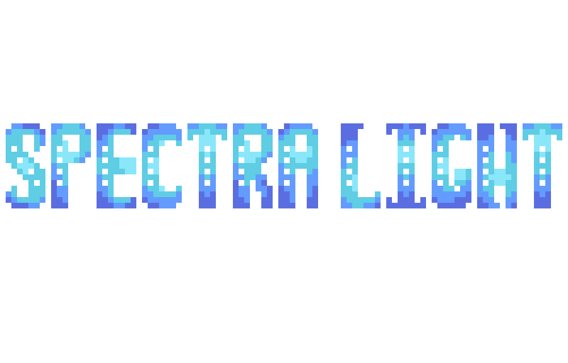

  

---

SpectraLight (often shorthanded to SpL or Spectra) is an open source project aimed at creating a lower population HRP-inclined environment within the Space Station 14 infrastructure. We are based primarily off of the STARLIGHT fork, although content porting is welcome from any fork that permits it.

SpectraLight is a fork of Space Station 14, an emergent narrative game about survival on a space station where there are constant confrontations between the crew, antagonists opposed to them, and the harsh (un)realities of deep space.

## Contributing
This is the primary and sole running repository for the SpectraLight private server– if you wish to add something to SpectraLight, you've come to the right place! We are happy to accept contributions from any of our players, new or returning.

Don't be afraid to ask for help! We have a small but dedicated team of contributors, most of whom also started with little to no knowledge on what they were doing.

### Space Station 14 Documentation

Space Station 14 has a very [robust wiki](https://docs.spacestation14.io/) detailing SS14's content, engine, game design and more. If you're brand new to contributing to SS14, or even to any sort of development at all, this is a great place to start.

### Getting Started

If you wish to contribute to SpectraLight but have no idea what you're doing, you can start by [following](https://docs.spacestation14.com/en/general-development/setup/howdoicode.html) [the](https://docs.spacestation14.com/en/general-development/setup/setting-up-a-development-environment.html) [instructions](https://docs.spacestation14.com/en/general-development/setup/git-for-the-ss14-developer.html) provided by Space Wizards Federation on starting out, using git, and setting up a development environment.

It is <u><b>highly recommended</u></b> that you use [Jetbrains Rider](https://www.jetbrains.com/rider/) for any development due to the vast majority of game changes being done through the YAML data serialisation language, which IDEs like the Visual Studio family are severely lacking in support for.

## License
SpectraLight is provided and maintained under the [MIT License](https://opensource.org/license/MIT), making it compatible with all other forks that share the license. Certain features created under the [AGPL 3.0 License](https://www.gnu.org/licenses/agpl-3.0.en.html) have been relicensed with permission for use in this fork.

All SpectraLight non-code assets (such as artwork and sounds) are licensed under the [Creative Commons 3.0 BY-SA](https://creativecommons.org/licenses/by-sa/3.0/) license unless stated otherwise by their attribution or metadata files, [for example](https://github.com/space-wizards/space-station-14/blob/master/Resources/Textures/Objects/Tools/crowbar.rsi/meta.json). Note that some assets are licensed under [CC-BY-NC-SA 3.0](https://creativecommons.org/licenses/by-nc-sa/3.0/) and may not be used commercially.

### Further Information

>The vast majority of our files are licensed under [MIT license](https://opensource.org/license/MIT), including Space Wizards Federation and STARLIGHT code.

>All other non-code assets, including icons and sound files, are licensed under the [Creative Commons 3.0 BY-SA](https://creativecommons.org/licenses/by-sa/3.0/) license unless stated otherwise.

